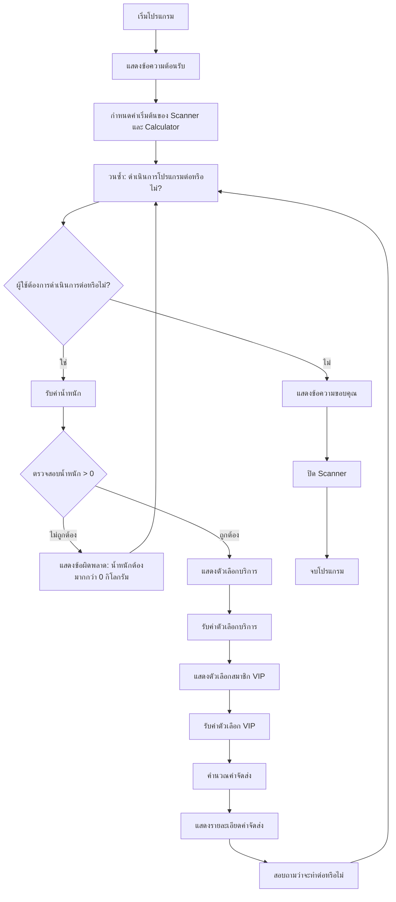

# เอกสารอัลกอริทึม: ระบบคำนวณค่าจัดส่งสินค้า

## แผนภาพลำดับงาน (Flowchart)



## รหัสเทียม (Pseudocode)

```
BEGIN ระบบคำนวณค่าจัดส่งสินค้า

    กำหนดค่าคงที่:
        ค่าบริการด่วน = 30.0
        อัตราส่วนลดVIP = 0.20
        อัตราค่าจัดส่งมาตรฐาน_0_1 = 40.0
        อัตราค่าจัดส่งมาตรฐาน_1_3 = 60.0
        อัตราค่าจัดส่งมาตรฐาน_3_5 = 80.0
        อัตราค่าจัดส่งมาตรฐาน_เกิน5 = 100.0
        อัตราค่าจัดส่งด่วน_0_1 = 60.0
        อัตราค่าจัดส่งด่วน_1_3 = 90.0
        อัตราค่าจัดส่งด่วน_3_5 = 120.0
        อัตราค่าจัดส่งด่วน_เกิน5 = 150.0

    ฟังก์ชัน คำนวณอัตราค่าจัดส่งมาตรฐาน(น้ำหนัก):
        ถ้า น้ำหนัก <= 0 แล้ว
            โยนข้อผิดพลาด IllegalArgumentException
        จบ ถ้า
        
        ถ้า น้ำหนัก <= 1 แล้ว
            คืนค่า อัตราค่าจัดส่งมาตรฐาน_0_1
        นอกนั้น ถ้า น้ำหนัก <= 3 แล้ว
            คืนค่า อัตราค่าจัดส่งมาตรฐาน_1_3
        นอกนั้น ถ้า น้ำหนัก <= 5 แล้ว
            คืนค่า อัตราค่าจัดส่งมาตรฐาน_3_5
        นอกนั้น
            คืนค่า อัตราค่าจัดส่งมาตรฐาน_เกิน5
        จบ ถ้า
    จบ ฟังก์ชัน

    ฟังก์ชัน คำนวณอัตราค่าจัดส่งด่วน(น้ำหนัก):
        ถ้า น้ำหนัก <= 0 แล้ว
            โยนข้อผิดพลาด IllegalArgumentException
        จบ ถ้า
        
        ถ้า น้ำหนัก <= 1 แล้ว
            คืนค่า อัตราค่าจัดส่งด่วน_0_1
        นอกนั้น ถ้า น้ำหนัก <= 3 แล้ว
            คืนค่า อัตราค่าจัดส่งด่วน_1_3
        นอกนั้น ถ้า น้ำหนัก <= 5 แล้ว
            คืนค่า อัตราค่าจัดส่งด่วน_3_5
        นอกนั้น
            คืนค่า อัตราค่าจัดส่งด่วน_เกิน5
        จบ ถ้า
    จบ ฟังก์ชัน

    ฟังก์ชัน คำนวณค่าจัดส่งรวม(น้ำหนัก, เป็นบริการด่วน, เป็นVIP):
        ถ้า เป็นบริการด่วน แล้ว
            ต้นทุนพื้นฐาน = คำนวณอัตราค่าจัดส่งด่วน(น้ำหนัก)
            ต้นทุนพื้นฐาน = ต้นทุนพื้นฐาน + ค่าบริการด่วน
        นอกนั้น
            ต้นทุนพื้นฐาน = คำนวณอัตราค่าจัดส่งมาตรฐาน(น้ำหนัก)
        จบ ถ้า
        
        ถ้า เป็นVIP แล้ว
            ต้นทุนพื้นฐาน = ต้นทุนพื้นฐาน * (1 - อัตราส่วนลดVIP)
        จบ ถ้า
        
        คืนค่า ต้นทุนพื้นฐาน
    จบ ฟังก์ชัน

    ฟังก์ชัน แสดงรายละเอียดค่าจัดส่ง(น้ำหนัก, เป็นบริการด่วน, เป็นVIP):
        พิมพ์ "รายละเอียดค่าจัดส่ง"
        พิมพ์ "น้ำหนัก: " + น้ำหนัก + " กก."
        พิมพ์ "ประเภทบริการ: " + (ถ้า เป็นบริการด่วน แล้ว "ด่วน" มิฉะนั้น "มาตรฐาน")
        พิมพ์ "สถานะ VIP: " + (ถ้า เป็นVIP แล้ว "VIP" มิฉะนั้น "ทั่วไป")
        
        ถ้า เป็นบริการด่วน แล้ว
            ต้นทุนพื้นฐาน = คำนวณอัตราค่าจัดส่งด่วน(น้ำหนัก)
            พิมพ์ "อัตราค่าจัดส่งด่วนพื้นฐาน: " + ต้นทุนพื้นฐาน
            พิมพ์ "ค่าบริการด่วน: +" + ค่าบริการด่วน
            ต้นทุนพื้นฐาน = ต้นทุนพื้นฐาน + ค่าบริการด่วน
        นอกนั้น
            ต้นทุนพื้นฐาน = คำนวณอัตราค่าจัดส่งมาตรฐาน(น้ำหนัก)
            พิมพ์ "อัตราค่าจัดส่งมาตรฐานพื้นฐาน: " + ต้นทุนพื้นฐาน
        จบ ถ้า
        
        ถ้า เป็นVIP แล้ว
            ส่วนลด = ต้นทุนพื้นฐาน * อัตราส่วนลดVIP
            พิมพ์ "ส่วนลด VIP (20%): -" + ส่วนลด
            ต้นทุนพื้นฐาน = ต้นทุนพื้นฐาน * (1 - อัตราส่วนลดVIP)
        จบ ถ้า
        
        พิมพ์ "ค่าจัดส่งรวม: " + ต้นทุนพื้นฐาน
    จบ ฟังก์ชัน

    โปรแกรมหลัก:
        กำหนดค่าเริ่มต้น scanner
        สร้างอ็อบเจกต์ ShippingCalculator
        
        พิมพ์ ข้อความต้อนรับ
        
        กำหนด ดำเนินการต่อ = จริง
        
        ขณะที่ ดำเนินการต่อ ทำ
            ลอง
                รับค่า น้ำหนัก
                
                ถ้า น้ำหนัก <= 0 แล้ว
                    พิมพ์ "ข้อผิดพลาด: น้ำหนักต้องมากกว่า 0 กิโลกรัม"
                    ทำต่อ วนซ้ำ
                จบ ถ้า
                
                พิมพ์ ตัวเลือกบริการ
                รับค่า ตัวเลือกบริการ
                กำหนด เป็นบริการด่วน = (ตัวเลือก == 2)
                
                พิมพ์ ตัวเลือกVIP
                รับค่า ตัวเลือกVIP
                กำหนด เป็นVIP = (ตัวเลือก == 1)
                
                เรียก แสดงรายละเอียดค่าจัดส่ง(น้ำหนัก, เป็นบริการด่วน, เป็นVIP)
                
                รับค่า ตัวเลือกทำต่อ
                กำหนด ดำเนินการต่อ = (ตัวเลือก == 1)
            
            ข้อผิดพลาด exception
                พิมพ์ "ข้อผิดพลาด: กรุณาใส่ข้อมูลที่ถูกต้อง"
                ล้าง บัฟเฟอร์scanner
            จบ ลอง
        จบ ขณะที่
        
        พิมพ์ ข้อความขอบคุณ
        ปิด scanner
    จบ หลัก

END ระบบคำนวณค่าจัดส่งสินค้า
```

## คำอธิบายอัลกอริทึม

ระบบคำนวณค่าจัดส่งสินค้าทำงานตามขั้นตอนดังนี้:

1. **รับข้อมูล**: โปรแกรมจะรวบรวมข้อมูลจากผู้ใช้ 3 อย่าง:
   - น้ำหนักของสินค้า (กิโลกรัม)
   - ประเภทการจัดส่ง (มาตรฐาน หรือ ด่วน)
   - สถานะสมาชิก VIP (ใช่ หรือ ไม่ใช่)

2. **กำหนดอัตราค่าจัดส่ง**: จากประเภทการจัดส่งและน้ำหนัก โปรแกรมจะกำหนดอัตราค่าจัดส่งพื้นฐาน:
   - สำหรับบริการมาตรฐาน:
     * 0-1 กก.: 40 บาท
     * >1-3 กก.: 60 บาท
     * >3-5 กก.: 80 บาท
     * >5 กก.: 100 บาท
   - สำหรับบริการด่วน:
     * 0-1 กก.: 60 บาท
     * >1-3 กก.: 90 บาท
     * >3-5 กก.: 120 บาท
     * >5 กก.: 150 บาท

3. **ค่าธรรมเนียมเพิ่มเติม**: หากเลือกบริการด่วน จะมีค่าธรรมเนียมเพิ่มเติม 30 บาท

4. **การหักลด**: หากลูกค้าเป็นสมาชิก VIP จะได้รับส่วนลด 20%

5. **แสดงผลลัพธ์**: โปรแกรมแสดงรายละเอียดของค่าใช้จ่ายและราคาสุดท้าย