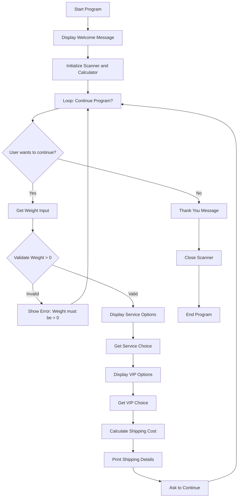

# Algorithm Documentation: Shipping Cost Calculator

## Flowchart



## Pseudocode

```
BEGIN Shipping Cost Calculator

    DEFINE constants:
        EXPRESS_SERVICE_FEE = 30.0
        VIP_DISCOUNT_RATE = 0.20
        STANDARD_RATE_0_1 = 40.0
        STANDARD_RATE_1_3 = 60.0
        STANDARD_RATE_3_5 = 80.0
        STANDARD_RATE_OVER_5 = 100.0
        EXPRESS_RATE_0_1 = 60.0
        EXPRESS_RATE_1_3 = 90.0
        EXPRESS_RATE_3_5 = 120.0
        EXPRESS_RATE_OVER_5 = 150.0

    FUNCTION calculateStandardRate(weight):
        IF weight <= 0 THEN
            THROW IllegalArgumentException
        END IF
        
        IF weight <= 1 THEN
            RETURN STANDARD_RATE_0_1
        ELSE IF weight <= 3 THEN
            RETURN STANDARD_RATE_1_3
        ELSE IF weight <= 5 THEN
            RETURN STANDARD_RATE_3_5
        ELSE
            RETURN STANDARD_RATE_OVER_5
        END IF
    END FUNCTION

    FUNCTION calculateExpressRate(weight):
        IF weight <= 0 THEN
            THROW IllegalArgumentException
        END IF
        
        IF weight <= 1 THEN
            RETURN EXPRESS_RATE_0_1
        ELSE IF weight <= 3 THEN
            RETURN EXPRESS_RATE_1_3
        ELSE IF weight <= 5 THEN
            RETURN EXPRESS_RATE_3_5
        ELSE
            RETURN EXPRESS_RATE_OVER_5
        END IF
    END FUNCTION

    FUNCTION calculateTotalShippingCost(weight, isExpress, isVIP):
        IF isExpress THEN
            baseCost = calculateExpressRate(weight)
            baseCost = baseCost + EXPRESS_SERVICE_FEE
        ELSE
            baseCost = calculateStandardRate(weight)
        END IF
        
        IF isVIP THEN
            baseCost = baseCost * (1 - VIP_DISCOUNT_RATE)
        END IF
        
        RETURN baseCost
    END FUNCTION

    FUNCTION printShippingDetails(weight, isExpress, isVIP):
        PRINT "Shipping Details"
        PRINT "Weight: " + weight + " kg"
        PRINT "Service Type: " + (IF isExpress THEN "Express" ELSE "Standard")
        PRINT "VIP Status: " + (IF isVIP THEN "VIP" ELSE "Regular")
        
        IF isExpress THEN
            baseCost = calculateExpressRate(weight)
            PRINT "Base Express Rate: " + baseCost
            PRINT "Express Fee: +" + EXPRESS_SERVICE_FEE
            baseCost = baseCost + EXPRESS_SERVICE_FEE
        ELSE
            baseCost = calculateStandardRate(weight)
            PRINT "Base Standard Rate: " + baseCost
        END IF
        
        IF isVIP THEN
            discount = baseCost * VIP_DISCOUNT_RATE
            PRINT "VIP Discount (20%): -" + discount
            baseCost = baseCost * (1 - VIP_DISCOUNT_RATE)
        END IF
        
        PRINT "Total Shipping Cost: " + baseCost
    END FUNCTION

    MAIN PROGRAM:
        INITIALIZE scanner
        CREATE ShippingCalculator instance
        
        PRINT welcome message
        
        SET continueProgram = TRUE
        
        WHILE continueProgram DO
            TRY
                INPUT weight
                
                IF weight <= 0 THEN
                    PRINT "Error: Weight must be greater than 0 kg"
                    CONTINUE loop
                END IF
                
                PRINT service options
                INPUT service choice
                SET isExpress = (choice == 2)
                
                PRINT VIP options
                INPUT VIP choice
                SET isVIP = (choice == 1)
                
                CALL printShippingDetails(weight, isExpress, isVIP)
                
                INPUT continue choice
                SET continueProgram = (choice == 1)
            
            CATCH exception
                PRINT "Error: Please enter valid data"
                CLEAR scanner buffer
            END TRY
        END WHILE
        
        PRINT thank you message
        CLOSE scanner
    END MAIN

END Shipping Cost Calculator
```

## Algorithm Logic Explanation

The shipping cost calculator follows these steps:

1. **Input Collection**: The program collects three pieces of information from the user:
   - Package weight in kilograms
   - Service type (Standard or Express)
   - VIP membership status (Yes or No)

2. **Rate Determination**: Based on the service type and weight, the program determines the base shipping rate:
   - For Standard service:
     * 0-1 kg: 40 THB
     * >1-3 kg: 60 THB
     * >3-5 kg: 80 THB
     * >5 kg: 100 THB
   - For Express service:
     * 0-1 kg: 60 THB
     * >1-3 kg: 90 THB
     * >3-5 kg: 120 THB
     * >5 kg: 150 THB

3. **Additional Charges**: If Express service is selected, an additional 30 THB fee is added.

4. **Discount Application**: If the customer is a VIP member, a 20% discount is applied to the total cost.

5. **Output**: The program displays a detailed breakdown of the charges and the final cost.