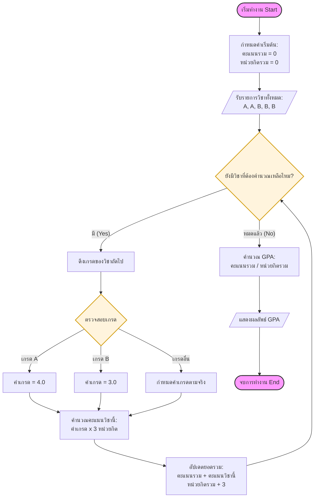

```mermaid
flowchart TD
    Start([เริ่มทำงาน Start]) --> Init[กำหนดค่าเริ่มต้น:\nคะแนนรวม = 0\nหน่วยกิตรวม = 0]
    Init --> Input[/รับรายการวิชาทั้งหมด:\nA, A, B, B, B/]
    Input --> LoopCondition{ยังมีวิชาที่ต้องคำนวณเหลือไหม?}

    LoopCondition -- มี (Yes) --> GetGrade[ดึงเกรดของวิชาถัดไป]
    GetGrade --> CheckGrade{ตรวจสอบเกรด}

    CheckGrade -- เกรด A --> SetA[ค่าเกรด = 4.0]
    CheckGrade -- เกรด B --> SetB[ค่าเกรด = 3.0]
    CheckGrade -- เกรดอื่น --> SetOther[กำหนดค่าเกรดตามจริง]

    SetA --> CalcSubject[คำนวณคะแนนวิชานี้:\nค่าเกรด x 3 หน่วยกิต]
    SetB --> CalcSubject
    SetOther --> CalcSubject

    CalcSubject --> UpdateTotal[อัปเดตยอดรวม:\nคะแนนรวม + คะแนนวิชานี้\nหน่วยกิตรวม + 3]
    UpdateTotal --> LoopCondition

    LoopCondition -- หมดแล้ว (No) --> CalcGPA[คำนวณ GPA:\nคะแนนรวม / หน่วยกิตรวม]
    CalcGPA --> ShowResult[/แสดงผลลัพธ์ GPA/]
    ShowResult --> End([จบการทำงาน End])

    %% Styling for better visualization
    style Start fill:#f9f,stroke:#333,stroke-width:2px
    style End fill:#f9f,stroke:#333,stroke-width:2px
    style LoopCondition fill:#fff4dd,stroke:#d4a017,stroke-width:2px
    style CheckGrade fill:#fff4dd,stroke:#d4a017,stroke-width:2px
```
