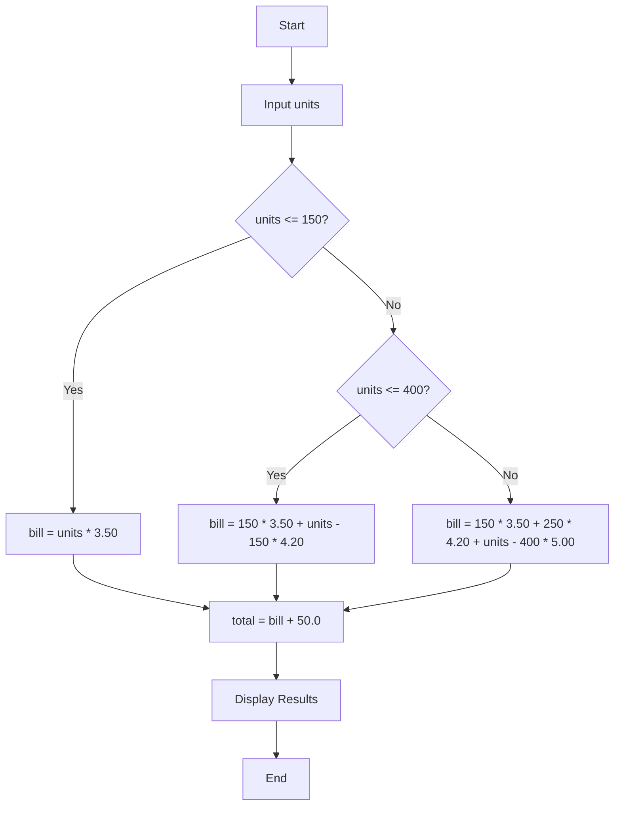

# Electricity Calculator Flowchart

```mermaid
graph TD
    A[Start] --> B[Input units]
    B --> C{units <= 150?}
    C -- Yes --> D[bill = units * 3.50]
    C -- No --> E{units <= 400?}
    E -- Yes --> F[bill = 150 * 3.50 + units - 150 * 4.20]
    E -- No --> G[bill = 150 * 3.50 + 250 * 4.20 + units - 400 * 5.00]
    D --> H[total = bill + 50.0]
    F --> H
    G --> H
    H --> I[Display Results]
    I --> J[End]
```
