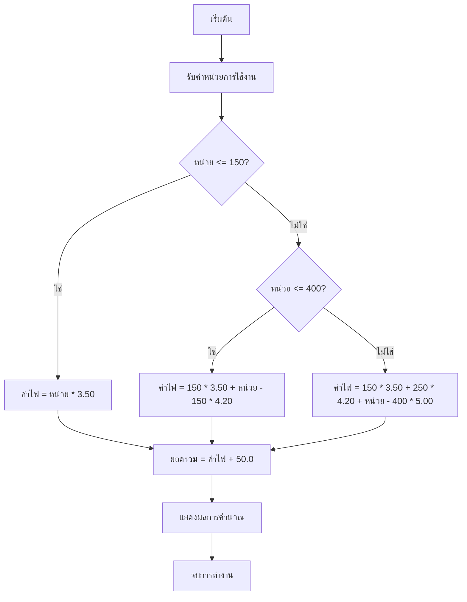

# ผังงานการคำนวณค่าไฟฟ้า (Electricity Calculator Flowchart)

```mermaid
graph TD
    A[เริ่มต้น] --> B[รับค่าหน่วยการใช้งาน]
    B --> C{หน่วย <= 150?}
    C -- ใช่ --> D[ค่าไฟ = หน่วย * 3.50]
    C -- ไม่ใช่ --> E{หน่วย <= 400?}
    E -- ใช่ --> F[ค่าไฟ = 150 * 3.50 + หน่วย - 150 * 4.20]
    E -- ไม่ใช่ --> G[ค่าไฟ = 150 * 3.50 + 250 * 4.20 + หน่วย - 400 * 5.00]
    D --> H[ยอดรวม = ค่าไฟ + 50.0]
    F --> H
    G --> H
    H --> I[แสดงผลการคำนวณ]
    I --> J[จบการทำงาน]
```
